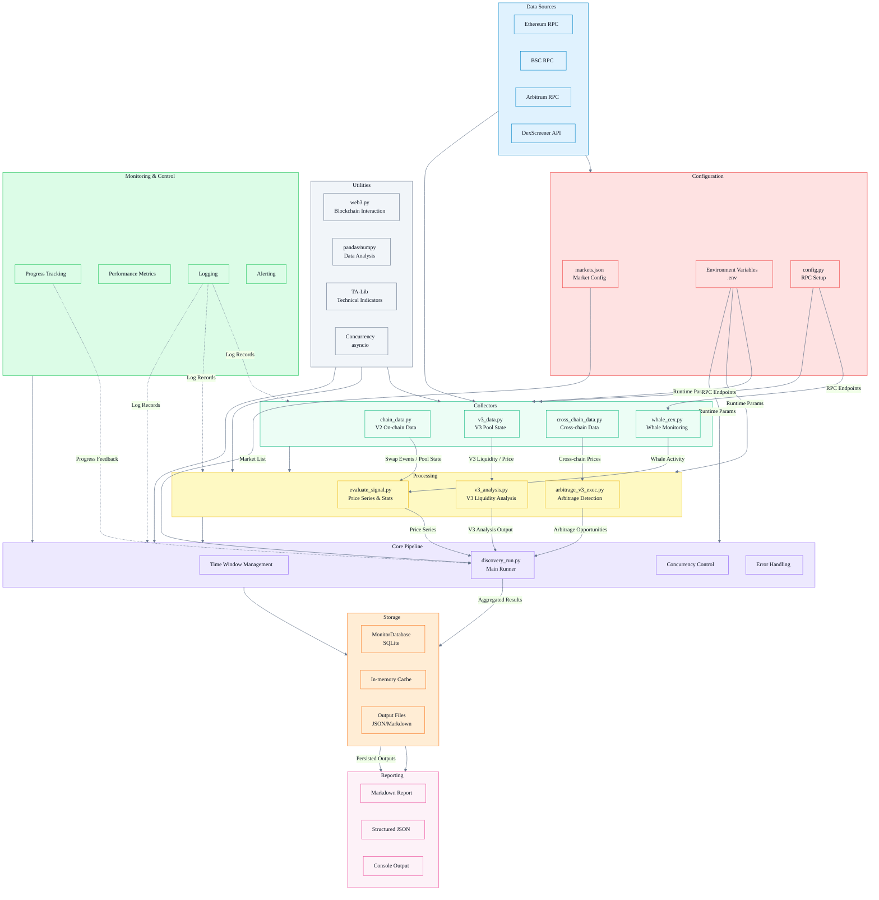

# DeFi Market Monitor V2

---

## 1. Data Source Selection

This project uses **Ethereum Mainnet (extensible to EVM chains such as BSC)** as the primary research target, focusing on **DEX trading flow and liquidity state**, covering:

- **Uniswap/Sushi V2: Swap events (trade flow)**  
  Used to build short-window price series, compute realized volatility/drawdown, and evaluate cross-pool spreads and executable arbitrage.

- **Uniswap V3: Pool state (slot0/liquidity) + local tick distribution (tickBitmap window)**  
  Used to understand how **concentrated liquidity** drives price sensitivity (slippage/depth) and structural differences across fee tiers (500/3000/10000).  (e.g., Uniswap v3 concentrated liquidity)

- **Cross-chain comparison (Ethereum vs BSC)**  
  For the same “economically equivalent trading pair” (e.g., USDC-ETH/WETH), the project compares **USD price, liquidity, volume, and txns** across chains, then estimates the cross-chain net spread. 

- **Risk-side signals**  
  CEX net inflow and whale sell pressure (used to help interpret short-window price/risk behavior).

Why this is valuable:  
**DEX trades and arbitrage/MEV signals** are on-chain, auditable, and highly real-time. They support both **arbitrage opportunity discovery** and **risk analysis** (volatility, drawdown, liquidity changes, and cross-chain migration costs).

---

## 2. What the Project Does (Outputs & Report Structure)

After running, the system generates a **Markdown report** (`backend/pipelines/output/report_*.md`) with the following core sections:

1. **Swap Collection (V2)**: swap count in the window, price points, first/last price  
2. **Realized Stats**: realized return, realized volatility, maximum drawdown (derived from the swap price series)
3. **Whale / CEX Flows**: whale sell count/amount, CEX net inflow
4. **Arbitrage (V2 cross-pool spread)**: cross-pool spread + whether it clears gas
5. **Uniswap V3 Snapshot**: slot0/tick/liquidity/price across multiple fee tiers
6. **V3 Executable Arbitrage (V3↔V3)**: executable arbitrage screening across V3 pools (two modes: fast/deep)
7. **Cross-chain Comparison**: cross-chain USD price comparison + net spread under cost assumptions

The assessment requirement “working script + README explaining how to run / what is collected / what you learned” is implemented via `discovery_run.py` and materialized through the generated report.

---

## 3. Key Findings from the Report

### 3.1 Market Behavior (Short Window)
- Price moves upward within a 1-hour window (first-to-last price increases), while realized volatility is at several-percent magnitude, indicating non-trivial short-term fluctuations. The max drawdown is negative, showing meaningful intra-window pullbacks (“uptrend with a noticeable drawdown along the way”).

### 3.2 Trading / Capital Flows (Risk Side)
- Positive CEX net inflow can be interpreted as a risk-side signal: assets moving from on-chain back to exchanges (potential sell-prep), and can be used as a feature in a risk model.
- Whale selling equals 0, which indicates the current whale-detection threshold and the chosen sampling window did not capture large sell events. This does not imply large funds are absent; it depends on thresholds and address coverage.

### 3.3 V2 Cross-Pool Arbitrage
- The report detects cross-pool spreads, but **`profitable_after_gas=False`**:  
  meaning small spreads are consumed by **fees + gas**, which is a typical outcome in on-chain arbitrage (“price difference detected ≠ executable profit”).

### 3.4 V3 Fee Tier Structure
- For the same pair, `liquidity` differs significantly across fee tiers: usually 0.05%/0.3% tiers are deeper, while the 1% tier is often shallower. This implies:
  - Small trades may be cheaper in lower-fee pools
  - Large trades depend more heavily on depth (slippage becomes dominant)
- The report already includes V3 **tick/slot0/liquidity**, which is the foundation for analyzing “concentrated liquidity → slippage / impact cost”.

### 3.5 Uniswap V3↔V3 Arbitrage
- The V3 executable-arbitrage module may show a gross spread, while the net result (including fees + gas) is negative:  
  this is naturally explained by **fee-tier differences + gas costs**, meaning “spread exists, but it is not executable profit”.

### 3.6 Cross-Chain Comparison (Ethereum vs BSC)
- The system outputs `price_usd/liquidity/volume/txns` for both chains and reports gross/net spread.
- The current sample net spread is negative: under your assumptions (bridge fee, gas, slippage buffer, time risk), cross-chain arbitrage is not worthwhile (a very reasonable conclusion).

---

## 4. How to Apply the Data (Arb / MEV / Risk)

### 4.1 Arbitrage
- **Discovery layer**: compute spreads from multi-pool / multi-chain price snapshots (implemented: V2 cross-pool, V3↔V3, cross-chain comparison)
- **Executability layer**: include fees, gas, and (for cross-chain) bridge fee/time risk/slippage buffer to output net spread and best route (cost decomposition assumptions already exist)
- **Risk control layer**: if CEX net inflow or volatility spikes, reduce trading frequency or raise thresholds to avoid getting dominated by slippage in high-volatility regimes

### 4.2 MEV Detection (Next Enhancement)
Swaps + pool state are the foundation for MEV detection, but implementing detection algorithms typically requires:
- Recognizing same-block multi-swap patterns (sandwich/backrun)
- Transaction ordering and price-impact-reversion patterns

### 4.3 Risk Analysis
Using the current data, a lightweight risk score can be built from:
- realized vol and drawdown (market risk)
- V3 liquidity depth (liquidity risk)
- CEX net inflow (potential sell pressure)
- spreads and failed “executable arbitrage” attempts (a proxy for market efficiency, congestion, and cost pressure)

---

## 5. System architecture diagram



---

## 6. How to Run

### 6.1 Environment Setup
- Python 3.10+ (3.11 recommended)
- Working RPC endpoints (at least Ethereum Mainnet; add BSC for cross-chain comparison)
```bash
# === Blockchain node configuration ===
# ===== RPC =====
RPC_URL_MAINNET=https://<your-ethereum-rpc>

# Optional: required for cross-chain comparison
RPC_URL_BSC=https://<your-bsc-rpc>

# ===== Execution cost / gas (optional but recommended) =====
# Fixed gas price (wei). If unset, read from node; if that fails, fall back to a default.
GAS_PRICE_WEI=30000000000

# V3 arbitrage mode: fast / deep (default: fast)
V3_ARB_MODE=fast

# FAST mode estimates gas bps based on a token0 trade size assumption (default: 10000)
V3_ARB_TRADE_SIZE_TOKEN0=10000

# ===== Cross-chain cost terms (optional) =====
GAS_COST_USD_ETHEREUM=8.3
GAS_COST_USD_BSC=1.0

```
### 6.2 Install Dependencies
```bash
python -m venv .venv
source .venv/bin/activate  
pip install -r requirements.txt
```
### 6.3 Generate the Report
```bash
export V3_ARB_MODE=deep
python backend/pipelines/discovery_run.py --chain mainnet --hours 1
Report location:
✅ Report successfully generated: ./defi-market-monitor/backend/pipelines/output/
```
## Appendix: How to Quickly Locate and Understand the “Data Discovery Report” (Key Metric Explanations)

This report is a complete “DeFi market monitoring & opportunity evaluation” output, covering:  
**on-chain trade collection → price series construction → risk metric computation → arbitrage screening → Uniswap V3 state snapshot → V3 deep executability validation → cross-chain price comparison & net-return estimation**.  
Recommended reading order: from “data pipeline is working” to “opportunity is executable”.

---

### 1) Report Metadata (Generated / Chain / Window)
- **Generated**: report generation timestamp, used to verify this is a real output from the current run.  
- **Chain**: the network used for on-chain data (e.g., `mainnet`).  
- **Window**: analysis time range (e.g., 24 hours). All metrics are computed within this window.

---

### 2) Swap Collection (On-Chain Trade Collection & Price Series Sanity Check)
- **Swaps collected**: number of Swap trades collected in the window.  
- **Price points computed**: number of price points parsed from Swap events.  
  - Usually equal to swaps collected. If price points are much fewer, parsing may be failing or filtering may be too aggressive.
- **First price / Last price (token0 per token1)**: first and last price points in the window.  
  - Interprets “how many units of token0 per 1 unit of token1” (token0/token1 definition depends on the monitored pair for the run).

---

### 3) Realized Stats (Core Return/Risk Metrics from the Price Series)
These are computed directly from the price series and summarize the market behavior in the window:

- **Realized return**: cumulative return over the window.  
  - Negative indicates an overall decline; positive indicates an overall rise.
- **Realized vol**: realized volatility.  
  - Larger values mean less stable prices and more intense short-term fluctuations.
- **Max drawdown**: maximum drawdown.  
  - The largest peak-to-trough drop observed in the window; a measure of worst-case downside risk.

---

### 4) Whale / CEX Flows (Large-Account Behavior & Exchange Flow Signals)
This adds a “behavior interpretation layer” beyond price:

- **Whale sell pressure**: total size classified as “whale selling” (in ETH or equivalent).  
- **Selling whales**: number of whale addresses identified as sellers.  
- **CEX net inflow**: net flow into centralized exchanges.  
  - Positive can be interpreted as assets moving to exchanges (potential sell pressure or rebalancing); negative can be interpreted as assets leaving exchanges (withdrawal/holding).

---

### 5) Arbitrage (cross-pool spread) (Same-Chain Cross-Pool Price Difference)
This section finds instantaneous price differences across pools for the same pair on the same chain:

- **Opportunities detected**: number of cross-pool opportunities detected.  
- Each opportunity includes:
  - **pair**: trading pair (token address combination).  
  - **spread**: gross spread percentage (surface-level difference only).  
  - **low_pool / high_pool**: the low-price and high-price pools (the buy-low / sell-high endpoints).  
  - **profitable_after_gas**: whether the opportunity remains profitable after gas cost.

> `spread` is only the price difference; `profitable_after_gas` is the cost-adjusted profitability check.

---

### 6) Uniswap V3 Snapshot (V3 Pool State Snapshot)
This reads key Uniswap V3 state fields to support V3 analysis and fee-tier comparisons:

- **V3 pools scanned**: number of scanned V3 pools.  
- Each pool includes:
  - **pool**: pool address  
  - **fee**: fee tier (e.g., 500=0.05%, 3000=0.3%, 10000=1%)  
  - **tick**: current tick index (V3 price discretization coordinate)  
  - **liquidity**: active liquidity at the current tick range  
  - **price_token1_per_token0**: spot price converted from `sqrtPriceX96` (token1/token0)

> In V3, price and trade feasibility are constrained by tick liquidity distribution; fee tiers can show different price/feasibility behaviors for the same pair.

---

### 7) V3 Executable Arbitrage (V3↔V3 Deep Executability Validation / deep mode)
This section does not only compare “spot spreads”; it attempts tick-level swap-step simulation to determine if an arbitrage route is executable.

Key fields:
- **mode: deep**: deep mode scans ticks and runs a heavier simulation.  
- **spot_buy_price / spot_sell_price**: spot prices used for surface spread estimation.  
- **executable**: whether the route is executable under simulation constraints.  
- **reason**: direct reason for non-executability (e.g., sell leg incomplete, zero output, insufficient tick data).  
- **buy_leg_debug / sell_leg_debug**: debug info for each swap leg:
  - `crossed_ticks`: number of initialized ticks crossed during simulation  
  - `incomplete`: whether the leg halted due to tick boundary/data insufficiency/liquidity issues  
  - `amount_in_consumed / amount_in_left`: consumed input and leftover input  
- **assumptions**: key simulation assumptions:
  - `trade_size_token0`: assumed trade size  
  - `words_each_side / max_ticks`: tick scan width/limit  
  - `max_tick_cross`: cap on tick crossing count (limits simulation complexity)

> `executable=false` does not mean “no spread”; it indicates that under current tick scan range and constraints, the route cannot complete both legs or cannot produce valid output.

---

### 8) Cross-chain Comparison (Cross-Chain Price Comparison & Net Return Estimation)
This compares the same pair across chains and provides a full cost breakdown from gross spread to net profitability.

Recommended reading order:
1. **chains**: participating chains (e.g., `ethereum`, `bsc`).  
2. **pairs[].chains.{chain}**: market data per chain (from DexScreener), key fields:
   - `price_usd`: USD price on that chain  
   - `liquidity_usd`: pool liquidity size  
   - `volume_h24 / h6 / h1`: volume  
   - `txns_*`: buy/sell transaction counts  
   - `labels`: pool version (e.g., v3/v2)
3. **arbitrage[]**: cross-chain arbitrage computation output, key fields:
   - **gross_spread_bps**: gross spread in bps (1 bps = 0.01%)  
   - **net_spread_bps**: net spread after costs (bridge fee, gas, slippage buffer, time risk)  
   - **assumptions**: cost/risk decomposition:
     - `trade_size_usd`: assumed trade size  
     - `bridge.fixed_fee_usd / variable_fee_bps / eta_seconds`: bridge fees and ETA  
     - `gas_cost_usd_total`: total gas cost (USD)  
     - `cost_components_bps`: component breakdown (bridge fixed fee, bridge variable fee, gas, slippage buffer, time risk)

> `gross_spread_bps` measures only price difference; `net_spread_bps` reflects the true result after costs. `net_spread_bps < 0` means not profitable under the current assumptions.

---

### 9) Raw JSON (Structured Output for Verification and Further Processing)
`Raw JSON` aggregates all structured results for this run, suitable for:
- automated storage/backfill and backtesting
- secondary visualization (charts/tables)
- auditing the source of any metric (e.g., realized stats, arbitrage fields, cross-chain cost breakdown)

