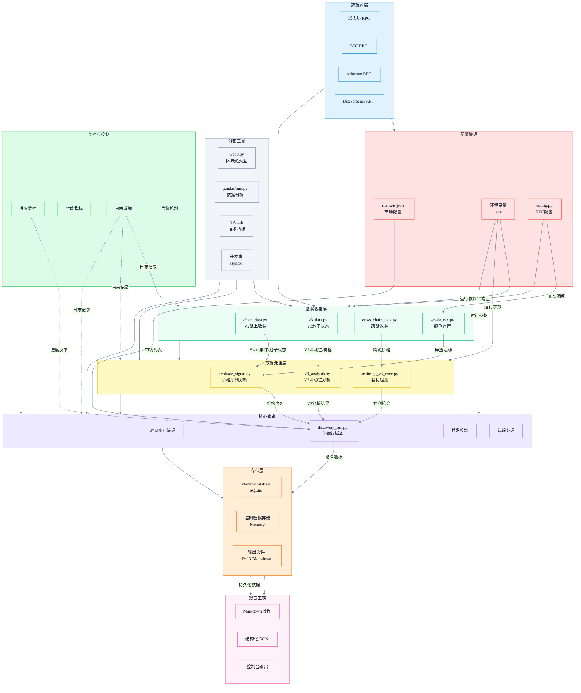

# DeFi Market Monitor V2

---

## 1. 数据源的选择

本项目选择以 **Ethereum Mainnet（可扩展到 BSC 等 EVM 链）** 为主要研究对象，聚焦 **DEX 交易与流动性状态**，覆盖：
- **Uniswap/Sushi V2：Swap 事件（交易流）**  
  用于构建短窗口价格序列、计算已实现波动率/回撤，并用于跨池价差与可执行套利评估。
- **Uniswap V3：Pool 状态（slot0/liquidity）+ 局部 tick 分布（tickBitmap window）**  
  用于理解**集中流动性**导致的价格敏感性（滑点/深度）以及不同 fee tier 的结构差异（500/3000/10000）。这属于题目鼓励的“advanced mechanics（例如 Uniswap v3 集中流动性）”方向。 
- **跨链对比（Ethereum vs BSC）**：同一“经济意义上的交易对”（如 USDC-ETH/WETH）在不同链上的 **USD price、liquidity、volume、txns**，再估算跨链净价差。属于题目 bonus 的“Cross-chain comparisons”。
- **风险侧信号**：CEX 净流入、巨鲸卖出压力（用于辅助解释短周期价格/风险）

为什么有价值：  
 **DEX 交易、套利/MEV 信号**，且链上可审计、实时性强；它能同时支持 **套利机会发现** 与 **风险分析**（波动、回撤、流动性变化、跨链迁移成本）。 

---

## 2. 项目能做什么（产出与报告结构）

运行后会生成一个 **Markdown 报告**（`backend/pipelines/output/report_*.md`），核心模块包括：

1. **Swap Collection（V2）**：窗口内 swap 数、价格点、首尾价  
2. **Realized Stats**：已实现收益、波动率、最大回撤（来自 swaps 价格序列）
3. **Whale / CEX Flows**：巨鲸卖出计数/总量、CEX 净流入
4. **Arbitrage（V2 跨池价差）**：跨池 spread + 是否覆盖 gas
5. **Uniswap V3 Snapshot**：多个 fee tier 的 slot0/tick/liquidity/price
6. **V3 Executable Arbitrage（V3↔V3）**：对 V3 pool 进行可执行套利筛选（两种模式：fast/deep）
7. **Cross-chain Comparison**：跨链 USD 价格对比 + 成本假设下的净价差

题目要求的“working script + README 说明如何运行/采集什么/学到了什么”在本项目中由 `discovery_run.py` 驱动并通过报告落地。

---

## 3. 报告里的关键发现

### 3.1 市场行为（短窗口）
- 价格在 1 小时窗口内上行（首尾价提升），同时 realized vol 在几个百分点量级，说明短时段波动并不低；max drawdown 为负，体现途中回撤存在（“上行但有明显回撤”）。

### 3.2 交易/资金流（风险侧）
- CEX 净流入为正：可解释为“资产从链上回流到交易所”的风险信号之一（潜在卖压准备），也可作为风险模型的特征输入。
- Whale 卖出为 0：说明你当前巨鲸识别阈值/样本窗口下未捕捉到大额卖出，但不代表没有大资金（需要结合阈值设置与地址覆盖）。

### 3.3 V2 跨池套利
- 报告检测到跨池 spread，但 **profitable_after_gas=False**：  
  说明**微小价差被手续费 + gas 吃掉**，这是链上套利的常态结论之一（“发现价差 ≠ 可执行盈利”）。

### 3.4 V3 fee tier 结构
- 同一交易对在不同 fee tier 的 `liquidity` 差异巨大：通常 0.05%/0.3% 档会更深，1% 档更浅；这意味着：
  - 小单可能在低费池更划算
  - 大单更依赖深度（滑点更关键）
- 你已经把 V3 的 **tick/slot0/liquidity** 拉到报告里，这是分析“集中流动性导致滑点/冲击成本”的基础。

### 3.5 Uniswap V3↔V3 套利
- 你的 V3 可执行套利模块给出 gross spread，但 net spread（含手续费+gas）为负：  
  这很好解释为 **fee tier 差异 + gas 成本** 使得“看起来有价差，但不可执行盈利”。

### 3.6 跨链对比（Ethereum vs BSC）
- 得到两个链上的 `price_usd/liquidity/volume/txns`，并输出 gross/net spread。  
- 当前示例净价差为负：说明在你设定的桥费、gas、滑点缓冲、时间风险等假设下，跨链套利不划算（这是非常合理的结论）。

---
## 4. 如何应用这些数据（Arb / MEV / Risk 的落地方式）

### 4.1 套利（Arbitrage）
- **发现层**：基于多池/多链的价格快照计算 spread（已实现 V2 跨池、V3↔V3、跨链对比）
- **可执行层**：引入手续费、gas、（跨链）桥费/时间风险/滑点缓冲，输出 net spread 与 best route（你已有成本拆分假设）
- **风控层**：如果 CEX 净流入/波动突然放大，可对套利策略降频或提高阈值（避免高波动期被滑点吞噬）

### 4.2 MEV Detection（下一步增强点）
当前采集了 swaps + pool state，这是 MEV 检测的基础数据，但要实现“检测算法”，通常需要：
- 同块多笔 swap 的模式识别（sandwich/backrun）
- 交易排序与价格冲击回撤形态

### 4.3 风险分析（Risk Analysis）
利用已有数据，构建轻量风险评分：
- realized vol、drawdown（市场风险）
- V3 流动性深度（流动性风险）
- CEX 净流入（潜在抛压）
- 价差与失败的“可执行套利”（市场效率/拥堵与成本压力的侧面指标）

---

## 5. 系统架构图


---

## 6. 运行方式

### 6.1 环境准备
- Python 3.10+（推荐 3.11）
- 可用的 RPC（至少 Ethereum Mainnet；如需跨链对比再加 BSC）
```bash
# === 区块链节点配置 ===
# ===== RPC =====
RPC_URL_MAINNET=https://<your-ethereum-rpc>

# 可选：跨链对比需要
RPC_URL_BSC=https://<your-bsc-rpc>

# ===== 执行成本 / gas（可选但建议）=====
# 固定 gas price（wei），不填则会从节点读取；失败则回退默认
GAS_PRICE_WEI=30000000000

# V3 套利模式：fast / deep（默认 fast）
V3_ARB_MODE=fast

# FAST 模式估算 gas bps 需要一个 token0 交易规模假设（默认 10000）
V3_ARB_TRADE_SIZE_TOKEN0=10000

# ===== 跨链对比成本项（可选）=====
GAS_COST_USD_ETHEREUM=8.3
GAS_COST_USD_BSC=1.0
```
### 6.2 安装依赖
```bash
python -m venv .venv
source .venv/bin/activate  
pip install -r requirements.txt
```
### 6.3 生成报告
```bash
export V3_ARB_MODE=deep
python backend/pipelines/discovery_run.py --hours 24 
报告位置：
✅ Report successfully generated: ./defi-market-monitor/backend/pipelines/output/
```

---
## 附录：如何快速定位并读懂《Data Discovery Report》（关键指标解释）

本报告是一次“DeFi 市场监控与机会评估”的完整输出，覆盖 **链上交易数据采集 → 价格序列构建 → 风险指标计算 → 套利机会筛选 → Uniswap V3 状态快照 → V3 可执行性深度验证 → 跨链价格对比与净收益测算**。  
建议按以下顺序阅读（从“数据是否跑通”到“机会是否可执行”）。

---

### 1）报告基本信息（Generated / Chain / Window）
- **Generated**：报告生成时间戳，用于确认输出是本次真实运行结果。  
- **Chain**：本次链上数据来源的网络（如 `mainnet`）。  
- **Window**：分析窗口起止时间（例如 24 小时）；报告内统计与指标均基于该时间段。

---

### 2）Swap Collection（链上交易采集与价格序列是否跑通）
- **Swaps collected**：窗口内采集到的 Swap 交易数量。  
- **Price points computed**：从 Swap 事件中解析并构建出的价格点数量。  
  - 通常两者相等，表示每笔 swap 都成功转成一个价格点；若价格点显著少于 swap，可能意味着解析失败或过滤较多。
- **First price / Last price（token0 per token1）**：窗口首尾的价格点。  
  - 表示“1 个 token1 价值多少 token0”（token0/token1 的定义以本次监控交易对为准）。

---

### 3）Realized Stats（从价格序列计算的核心风险/收益指标）
这些指标由价格序列直接计算，用于概括窗口内市场表现：

- **Realized return**：窗口内累计收益率。  
  - 负值代表价格整体下跌，正值代表价格整体上涨。
- **Realized vol**：已实现波动率。  
  - 数值越大表示价格越不稳定、短期波动更剧烈。
- **Max drawdown**：最大回撤。  
  - 表示从窗口内某一峰值到后续最低点的最大跌幅，用于衡量“最坏情况下的下行风险”。

---

### 4）Whale / CEX Flows（大额行为与交易所资金流信号）
该部分用于补充价格之外的“行为解释层”信息：

- **Whale sell pressure**：识别为“巨鲸卖出”的累计规模（以 ETH 或等价计量）。  
- **Selling whales**：识别到的卖出巨鲸地址数量。  
- **CEX net inflow**：中心化交易所净流入。  
  - 正值通常可理解为更多资产流入交易所（可能对应潜在卖压或换仓需求），负值则更像从交易所流出（可能对应持币/提币）。

---

### 5）Arbitrage (cross-pool spread)（同链跨池价差机会）
该部分寻找 **同一条链上、同一交易对** 在不同池子之间的即时价差：

- **Opportunities detected**：检测到的跨池价差机会数量。  
- 每条机会包含：
  - **pair**：交易对（以 token 地址组合表示）。  
  - **spread**：两池报价形成的毛价差百分比（只反映表面价差）。  
  - **low_pool / high_pool**：低价池与高价池地址（对应“买低卖高”两端）。  
  - **profitable_after_gas**：是否在扣除 gas 成本后仍为正收益。  

> `spread` 只表示价格差；`profitable_after_gas` 才是“扣成本后的可盈利判断”。

---

### 6）Uniswap V3 Snapshot（V3 池状态快照）
该部分读取 Uniswap V3 池的关键状态字段，用于支持 V3 分析与费用档位比较：

- **V3 pools scanned**：扫描到的 V3 池数量。  
- 每个池列出：
  - **pool**：池地址  
  - **fee**：费用档位（例如 500=0.05%，3000=0.3%，10000=1%）  
  - **tick**：当前价格所在 tick（V3 价格离散化坐标）  
  - **liquidity**：当前可用流动性（与 tick 区间相关）  
  - **price_token1_per_token0**：由 `sqrtPriceX96` 转换得到的现货价格（token1 / token0）

> V3 的价格与可成交性受 tick 分布影响；同一交易对在不同 fee 档位池子可能出现价格与可执行性差异。

---

### 7）V3 Executable Arbitrage（V3↔V3 深度可执行性验证 / deep 模式）
该部分不是只比较“现货价差”，而是尝试基于 tick 数据做 swap step 级别模拟，用于判断套利路径是否可执行。

关键字段说明：
- **mode: deep**：启用深度模式，会扫描 ticks 并进行更重的模拟。  
- **spot_buy_price / spot_sell_price**：买入池与卖出池的现货价格对比（用于估算表面价差）。  
- **executable**：是否判定该路径在模拟条件下可执行。  
- **reason**：不可执行的直接原因（例如卖出腿模拟未完成、输出为 0、tick 数据不足等）。  
- **buy_leg_debug / sell_leg_debug**：两段 swap 的调试信息：
  - `crossed_ticks`：模拟过程中跨越的已初始化 tick 数  
  - `incomplete`：是否因 tick 数据不足、到达边界或流动性问题导致中断  
  - `amount_in_consumed / amount_in_left`：输入消耗与剩余量  
- **assumptions**：模拟使用的关键假设：
  - `trade_size_token0`：假设交易规模  
  - `words_each_side / max_ticks`：tick 扫描范围与上限  
  - `max_tick_cross`：最多跨 tick 数（限制模拟复杂度）

> `executable=false` 并不等于“没有价差”，而是说明在当前 tick 扫描范围与模拟约束下，路径无法完成完整的两段兑换或无法形成有效输出。

---

### 8）Cross-chain Comparison（跨链价格对比与净收益测算）
该部分对比同一交易对在不同链上的价格与流动性，并给出“跨链套利”从毛价差到净收益的全成本拆解。

阅读顺序建议：
1. **chains**：参与对比的链（例如 `ethereum`、`bsc`）。  
2. **pairs[].chains.{chain}**：每条链对应的市场数据（来自 DexScreener），关键字段：
   - `price_usd`：该链上该交易对的美元计价价格  
   - `liquidity_usd`：池子流动性规模  
   - `volume_h24 / h6 / h1`：成交量  
   - `txns_*`：买卖笔数  
   - `labels`：池版本标签（例如 v3/v2）
3. **arbitrage[]**：跨链套利计算结果，关键字段：
   - **gross_spread_bps**：毛价差（bps = 万分之一；1 bps = 0.01%）  
   - **net_spread_bps**：净价差（扣除桥费、gas、滑点缓冲、时间风险后的结果）  
   - **assumptions**：成本与风险假设拆解：
     - `trade_size_usd`：假设交易规模  
     - `bridge.fixed_fee_usd / variable_fee_bps / eta_seconds`：桥费用与预计耗时  
     - `gas_cost_usd_total`：两端 gas 成本合计（美元）  
     - `cost_components_bps`：成本分项（桥固定费、桥可变费、gas、滑点缓冲、时间风险）

> `gross_spread_bps` 只看价差；`net_spread_bps` 反映扣成本后的真实结果。`net_spread_bps < 0` 表示在当前假设下不可套利。

---

### 9）Raw JSON（原始结构化输出，用于复核与二次加工）
`Raw JSON` 汇总了本次运行所有模块的结构化结果，适合用于：
- 自动化落库/回填与回测
- 二次可视化（图表、表格）
- 复核某个模块数值来源（例如 realized 指标、arbitrage 字段、跨链成本拆解）